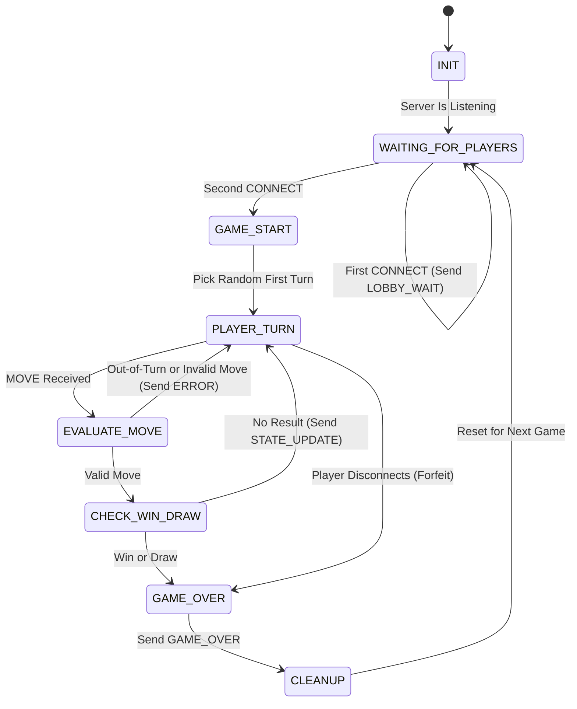

# FSM Specification: Tic-Tac-Toe Server

**Student:** Dustin Headington | **Course:** CS 457

## 1. State Diagram

## 2. States

| State | What the server does |
|---|---|
| `INIT` | Create the room and listen on the port. |
| `WAITING_FOR_PLAYERS` | The first `CONNECT` becomes `Player_1` (`X`) and gets `LOBBY_WAIT`. The second becomes `Player_2` (`O`). |
| `GAME_START` | Pick `first_turn` at random. Send `GAME_START` to each player, then send `STATE_UPDATE` to both. |
| `PLAYER_TURN` | Wait for a `MOVE`. |
| `EVALUATE_MOVE` | Check the move (section 3). If it fails, send `ERROR` and go back to `PLAYER_TURN`. |
| `CHECK_WIN_DRAW` | Check for a win, then a draw. If neither, flip the turn and send `STATE_UPDATE`. |
| `GAME_OVER` | Send `GAME_OVER` to each player who is still connected. |
| `CLEANUP` | Close both sockets and reset the room. |

## 3. Valid Moves

The server runs these checks in order:

1. The message is well formed (otherwise `MALFORMED_MESSAGE`).
2. It is the sender's turn (otherwise `OUT_OF_TURN`).
3. `row` and `col` are integers from 0 to 2 and the cell is empty (otherwise `INVALID_MOVE`).

A valid move is placed on the board. Then the server checks the result:

- **Win:** three of the mover's symbol in a row, column, or diagonal.
- **Draw:** nine moves have been made and there is no win.
- A win is checked first, so a ninth move that completes a line is a win.

## 4. Invalid Moves

The server sends `ERROR` to the sender only and goes back to `PLAYER_TURN`. The board and the turn do not change, and the server keeps running.

| Situation | Error |
|---|---|
| `MOVE` when it is not the sender's turn | `OUT_OF_TURN` |
| `row` or `col` missing, not an integer, or outside 0 to 2 | `INVALID_MOVE` |
| Cell already taken | `INVALID_MOVE` |
| Bad JSON, a missing field, an unknown type, a wrong `player_id`, or a message that is not allowed now | `MALFORMED_MESSAGE` |

## 5. Disconnections

A player has disconnected if the server receives a `DISCONNECT` message, `recv()` returns `b""`, a `ConnectionResetError` or `BrokenPipeError` is raised, or a send fails.

| State | What the server does |
|---|---|
| `WAITING_FOR_PLAYERS` | Remove the player and keep waiting. |
| `PLAYER_TURN` (either player) | Send `GAME_OVER` with `FORFEIT` to the player who stayed, then go to `CLEANUP`. |
| `GAME_START`, `EVALUATE_MOVE`, `CHECK_WIN_DRAW` | Finish the current step first. A win or draw that was already decided stands. Otherwise, handle it as in `PLAYER_TURN`. |
| `GAME_OVER`, `CLEANUP` | Ignore it. |
| Both players gone | Send nothing and go to `CLEANUP`. |